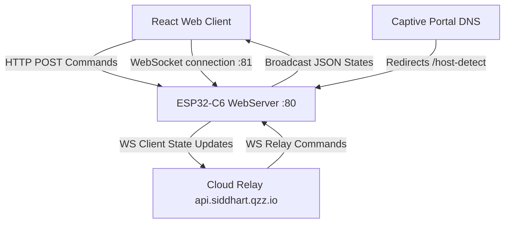

# LumaLamp Project Documentation (v1.0.4)

Welcome to the **LumaLamp Smart Light** project. This repository contains the complete codebase for a local smart-light lamp powered by the **ESP32-C6 SoC** and managed through a premium **React + Vite + TypeScript web dashboard**. 

---

## 🌌 System Architecture Overview

The project is structured as a decoupled IoT system that enables seamless real-time control, offline capability, and future over-the-air remote connectivity:



### 1. The React Web Client
A high-performance modern dashboard built using **Vite**, **TypeScript**, **TailwindCSS**, and **Lucide Icons**. It includes:
* **Interactive 3D Lamp Visualizer**: Powered by Three.js/React Three Fiber (in `ThreeLamp.tsx`) to represent the color and state changes.
* **Control Hub**: Color picker, Kelvin color-temperature slider, custom brightness slider, and preset shortcuts.
* **Effect Grid**: Instant application of WLED-style animations.
* **Automation Scheduler**: Program weekly ON/OFF timers stored locally in NVS.
* **Telemetry Display**: Live readings of ESP32-C6 RSSI signal, board core temperature, and uptime.
* **Developer Console**: Live log terminal outputting events from the device.

### 2. The ESP32-C6 Firmware (`finalv1.ino`)
Runs a multi-threaded network stack on the ESP32-C6 to support local offline operations, DNS spoofing, local APIs, and cloud syncing:
* **Seeded Suffix Identity**: Generates a persistent adjective + 4-digit code (e.g. `LumaLight-Golden-5839`) seeded by the globally unique MAC address of the chip.
* **Captive Setup AP**: If no Wi-Fi credentials are saved, it hosts the hotspot `LumaLight-<Suffix>` and routes all traffic to `/setup`.
* **mDNS Responder**: Binds the device to `http://lumalight.local/` on local home networks.
* **Optimized Web Server**: Exposes REST API routes and hosts cached HTML, CSS, and JS files from flash memory.
* **Bidirectional WebSockets**: Runs a WebSocket server on port `81` for sub-10ms state synchronization across multiple local clients.
* **Cloud WebSocket Client**: Keeps a persistent secure connection to the remote relay server (`api.siddhart.qzz.io`) for remote operations.

---

## 💡 Hardware & LED Configurations

The firmware is pre-configured to drive the onboard WS2812 addressable RGB LED found on standard ESP32-C6 DevKits:

* **Pin Mapping**: `GPIO 8` (onboard RGB LED pin).
* **LED Type**: `NEO_GRB` (standard WS2812 RGB).
* **LED Count**: `NUM_LEDS` is set to `1`.
* **Color Processing**: All calculations use standard 3-parameter (R, G, B) arrays. The music visualizer effect pulls and fades pixel colors using the correct `0x00RRGGBB` byte shift representation:
  ```cpp
  uint8_t r = (color >> 16) & 0xFF;
  uint8_t g = (color >> 8) & 0xFF;
  uint8_t b = color & 0xFF;
  ```

---

## 📡 Local REST API Endpoint Specifications

The local HTTP server listens on port `80` and implements the following endpoints:

### 1. `GET /api/status`
Returns the complete status telemetry of the system in JSON format.
* **Example Response**:
  ```json
  {
    "power": true,
    "brightness": 80,
    "color": {
      "r": 168,
      "g": 85,
      "b": 247,
      "hex": "#a855f7",
      "temp": 4000
    },
    "effect": "rainbow",
    "system": {
      "temp": 38.4,
      "rssi": -62,
      "uptime": 245,
      "deviceId": "LUMA-C6-Golden-5839",
      "name": "LumaLight-Golden-5839",
      "room": "Living Room",
      "freeHeap": 194820,
      "ip": "192.168.1.45"
    }
  }
  ```

### 2. `POST /api/power`
Toggles device power or updates brightness percentage.
* **Payload Format**: `{"power": true}` or `{"power": true, "brightness": 128}`

### 3. `POST /api/color`
Updates active color values, hex representation, and color temperature. Instantly halts any active animated effect.
* **Payload Format**: `{"r": 168, "g": 85, "b": 247, "hex": "#a855f7", "temp": 4000}`

### 4. `POST /api/effect`
Changes the active dynamic lighting effect.
* **Payload Format**: `{"effect": "aurora"}`
* **Available Effects**: `none`, `rainbow`, `aurora`, `sunset`, `ocean`, `fire`, `pulse`, `breathing`, `relax`, `gaming`, `music`.

### 5. `POST /api/settings`
Saves Wi-Fi configuration credentials and friendly identifiers to the Preferences NVS storage, then initiates a soft-restart.
* **Payload Format**: `{"ssid": "MySSID", "password": "MyPassword", "name": "LumaLight-Pro", "room": "Bedroom"}`

### 6. `POST /api/reboot`
Triggers an immediate soft restart of the micro-controller.
* **Payload Format**: Empty body

### 7. `POST /api/factory_reset`
Wipes the entire NVS memory partition (removing saved Wi-Fi, name, and color parameters) and reboots.
* **Payload Format**: Empty body

---

## 🔗 Local WebSocket Gateway (:81)

The local WebSockets server on port `81` processes the same JSON payload payloads for `power`, `brightness`, `color`, and `effect` as the REST APIs.
* **Inbound Handling**: Any valid control JSON sent over the socket updates the lamp immediately.
* **Outbound Broadcast**: On state change, the server broadcasts an event frame `{"event": "state", ...}` containing the complete lamp state to all connected socket clients. This ensures real-time sync across multiple open dashboard tabs.

---

## 🛠️ Build and Deployment Guide

### Firmware Setup (`finalv1.ino`)
1. **Toolchain**: Download and install the Arduino IDE or set up a VS Code + PlatformIO workspace.
2. **Board Manager**: Add the ESP32 boards repository URL to your preferences and install the `esp32` board library (version 2.x or 3.x). Select **ESP32C6 Dev Module** as your target board.
3. **Libraries**: Search for and install the following dependencies via the Arduino Library Manager:
   * **Adafruit NeoPixel** (by Adafruit)
   * **WebSockets** (by Markus Sattler)
   * **ArduinoJson** (by Benoit Blanchon, v7.x or v6.x)
4. **Compile & Flash**: Connect your ESP32-C6 via USB-C, select the correct COM port, and click upload.

### Web Dashboard Setup
1. Navigate to the root directory containing `package.json` in your terminal.
2. Install npm modules:
   ```bash
   npm install
   ```
3. Run the Vite local development server:
   ```bash
   npm run dev
   ```
4. Access the web panel on `http://localhost:5173`. Toggle the connection mode in **Advanced Settings** to `local_ip` and type your ESP32's IP address (or `lumalight.local`) to bridge the web dashboard directly to your local hardware.

---

## ⚠️ Troubleshooting & Operational Notes

> [!TIP]
> **mDNS Issues**: Some Windows machines or Android devices do not natively resolve `.local` domains. If `http://lumalight.local/` does not load, access the device using the local IP address assigned to it by your router (which can be found in your router's client list or the Arduino Serial monitor).

> [!IMPORTANT]
> **Captive Portal Detection**: If you connect to the `LumaLight-XXXX` hotspot and the Wi-Fi setup page does not auto-open, manually type `http://192.168.4.1/setup` into your mobile browser URL bar.

> [!WARNING]
> **Board Power Requirements**: If you experience erratic flickering or micro-controller brownouts when applying high-brightness states, check your power supply. The ESP32-C6 board and built-in RGB LED should be supplied with a stable USB-C connection or a dedicated 5V rail.
